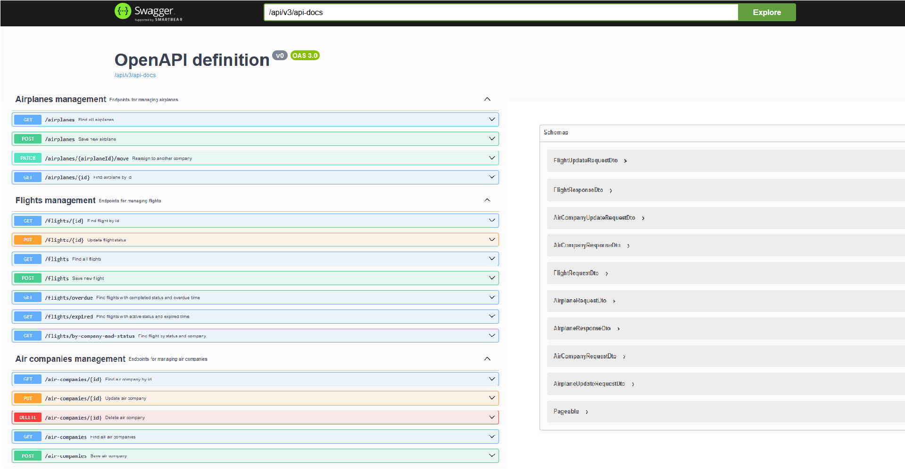
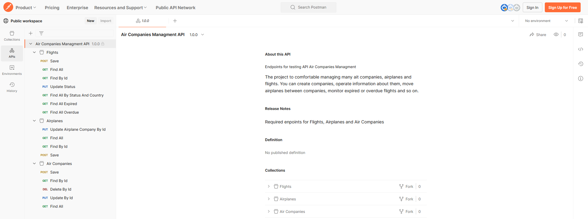

# Air Companies Management API

A project to comfortable managing many Air Companies, airplanes and flights.
You can create companies, operate information about them, move airplanes between companies, monitor expired or overdue flights and so on.

## Demo

### Swagger UI



### Postman Collection



## Tech Stack

Technologies that are used to create an efficient and well-organized environment for the development and management of the Air Companies Management API.

- **Java 11**

- **Spring Boot 2.2**

- **Spring Data JPA**

- **Mapstruct**

- **Lombok**

- **MySQL**

- **Docker**

- **Maven**

## Run Locally

**This API requires JDK 11 and Docker!!!**

If you don't have installed Java 11 or Docker, download it and install: 

- Link to download JDK: [Java 11](https://www.oracle.com/cis/java/technologies/javase/jdk11-archive-downloads.html)

- Link to download Docker: [Docker](https://docs.docker.com/desktop/install/windows-install/)

If you want to run locally this API, you'll need MySQL:

- Linl to download MySQL: [MySQL](https://dev.mysql.com/downloads/mysql/)

1. Clone the project

```
$ git clone https://github.com/fedorovychh/air-companies-manager.git
```
2. Start your Docker
3. Open API in Inteliji IDEA
4. Open resources folder and find an application.properties file. Then specify your MySQL DB password (if you want to run application locally).
```
spring.datasource.password=${DB_PASSWORD}
```

5. Open .env file in root folder and specify your MySQL DB password.

```
MYSQLDB_ROOT_PASSWORD=root
```

6. Run following terminal commands:
```
mvn clean package
```
This project is build on maven, so this command deletes target/ folder and creates .jar file, that is necessary for Docker.
```
docker-compose build
docker-compose up
```
These commands create image and run docker container.

Wait until next message will be shown:
```
Started AirCompaniesManagerApplication in 20 seconds
```

7. Open browser and follow address: http://localhost:8088/api/swagger-ui.html

Swagger UI added to demonstrate what endpoints does API contain.

**To test API properly, please use this [Postman Collection](https://www.postman.com/spaceflight-architect-34290083/workspace/public-workspace/api/3d017b1a-8a36-4ff0-9c24-1aa68bd4606d).**